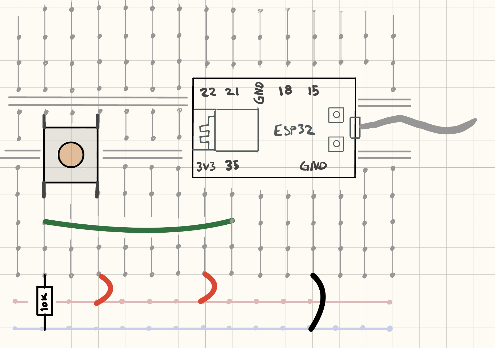

 
## Steg 1: Knapp

I steg 1 skal vi lese av en enkel knapp.

**OBS!** Dette steget og de neste stege forutsetter at du har følg instruksene for [Hello World i esp32-intro](https://github.com/knowit/esp32-intro/tree/main/Leksjoner/HelloWorld). 

### Firmware

Legg inn følgene i ```main.cpp```.

```cpp
#include "Arduino.h"

int counter = 0;

void setup() {
    Serial.begin(115200);
}

void loop() {
    Serial.print("Hello world # ");
    Serial.println(counter++);
    delay(500);
}
```

* Åpne filen ```platform.ini``` og sjekk at den har følgende innhold:

```ini
[env:esp32dev]
platform = espressif32
board = esp32dev
framework = arduino
monitor_speed = 115200
```
### Hardware

Koble opp som vist:




Last opp programmet.

Terminalen skal vises noe tilsvarende dette når du trykker på knappen:

```
button: 0
button: 1
button: 1
button: 0
button: 1
button: 0
```