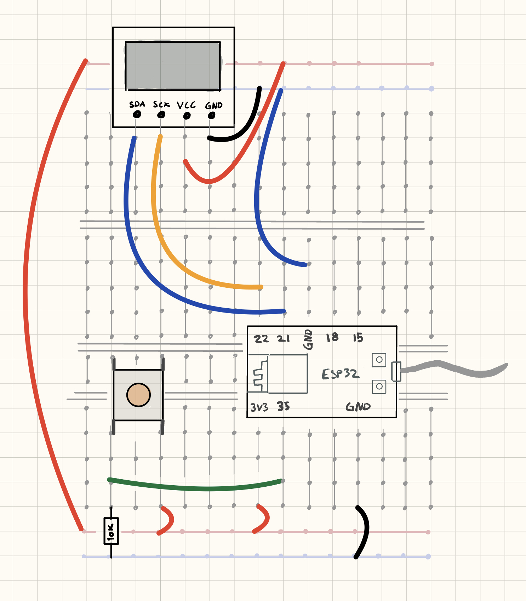
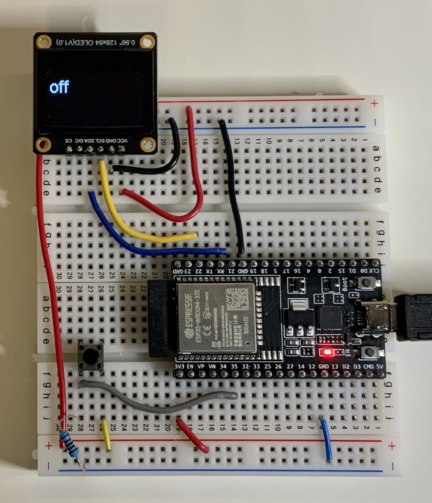

 
## Steg 2: OLED- skjerm

I steg 1 skal vi koble til en skjerm.


### Firmware

Legg inn følgene i ```main.cpp```.

```cpp
#include <Arduino.h>
#include <Wire.h>
#include "SSD1306Wire.h"

SSD1306Wire display(0x3c, SDA, SCL);

void setup()
{
  Serial.begin(115200);
  Serial.println("init");
  display.init();
  pinMode(35, INPUT);
  Serial.println("init..done");
}

void loop()
{
  Serial.print("button: X");
  Serial.println(digitalRead(35));

  display.clear();

  display.setTextAlignment(TEXT_ALIGN_LEFT);
  display.setFont(ArialMT_Plain_24);
  if (digitalRead(35))
  {
    display.drawString(0, 0, "on");
  }
  else
  {
    display.drawString(0, 0, "off");
  }

  display.display();

  delay(500);
}
```

* Åpne filen ```platform.ini``` og legg inn bibliotek for skjermen:

```ini
lib_deps = 
	thingpulse/ESP8266 and ESP32 OLED driver for SSD1306 displays@^4.2.1
```

### Hardware

Koble opp som vist:





Last opp programmet.

Nå du trykker på knappen skal skjermen vise enten "on" eller "off".
