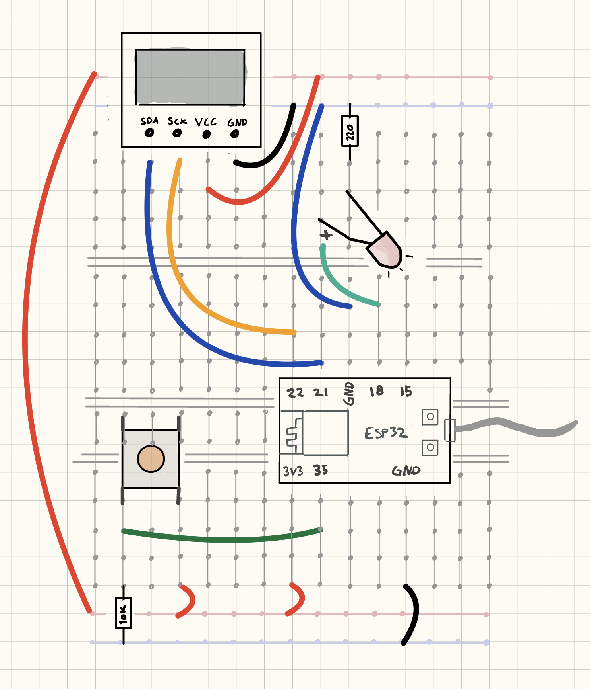
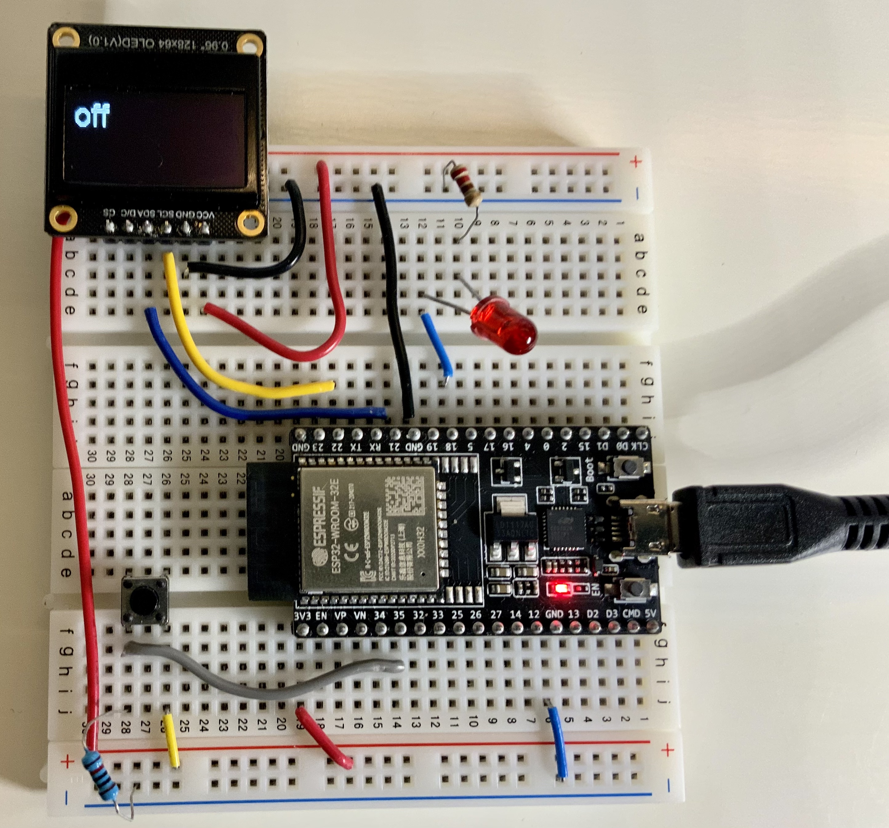

 
## Steg 2: LED

I steg 1 skal vi koble til en LED.


### Firmware

Legg inn følgene i ```main.cpp```.

```cpp
#include <Arduino.h>
#include <Wire.h>
#include "SSD1306Wire.h"

SSD1306Wire display(0x3c, SDA, SCL);

void setup()
{
  Serial.begin(115200);
  Serial.println("init");
  display.init();
  pinMode(18, OUTPUT);
  pinMode(35, INPUT);
  Serial.println("init..done");
}

void loop()
{
  Serial.print("button: ");
  Serial.println(digitalRead(35));
  digitalWrite(18, digitalRead(35));

  display.clear();

  display.setTextAlignment(TEXT_ALIGN_LEFT);
  display.setFont(ArialMT_Plain_24);
  if (digitalRead(35))
  {
    display.drawString(0, 0, "on");
  }
  else
  {
    display.drawString(0, 0, "off");
  }

  display.display();

  delay(500);
}
```


### Hardware

Utvid kretsen med LED:





Last opp programmet.

Nå du trykker på knappen, lyser LED-en.
