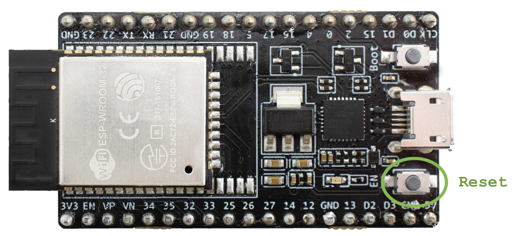

  
## Første program: Hello World

Ved programmering av mikrokontrollere bør man alltid begynne med et veldig enkelt program for å sjekke at alt fungerer som det skal.

* Koble ESP32 på en SnappySense v1.1 eller v1.2 til en ledig USB-A - port

* Følg [Quick  Quick Start guide](https://docs.platformio.org/en/latest/integration/ide/vscode.html#quick-start) med noen modifikasjoner (se under)


* I Project Wizard fyll ut dette:

| Felt | Verdi |
|------|-------|
| **Name:** | HelloWorld
| **Board:** | featheresp32
| **Framework:** | Arduino

* Hvis du får spørsmålet "Do you trust the authors of the files in this folder?", klikk på Trust the authors .. og deretter "Yes, I trust the authors"
* Istedenfor å kopiere inn kodeeksempelet ````Blink```` inn i ```main.cpp```,  kopierer du inn dette istedet:

```cpp
#include "Arduino.h"

int counter = 0;

void setup() {
    Serial.begin(115200);
}

void loop() {
    Serial.print("Hello world # ");
    Serial.println(counter++);
    delay(500);
}
```

* Åpne filen ```platformio.ini``` og legg til en ny linje:

```ini
monitor_speed = 115200
```

Seksjonen ```[env:esp32dev]``` skal nå se ca. slik ut:

```ini
[env:esp32dev]
platform = espressif32
board = esp32dev
framework = arduino
monitor_speed = 115200
```


***Problemer*** med å kommunisere med mikrokontrolleren? Se [Feilsøking, serieport](../../Feilsoeking/Serieport/README.md)

* Trykk på Upload på nederste verktøylinje i VSCode:


Hvis alt gitt bra fikk du masse underlig tekst med dette her mot slutten:
```
Writing at 0x00020000... (62 %)
Writing at 0x00024000... (75 %)
Writing at 0x00028000... (87 %)
Writing at 0x0002c000... (100 %)
Wrote 271360 bytes (126755 compressed) at 0x00010000 in 3.2 seconds (effective 669.1 kbit/s)...
```

* Trykk på Serial Monitor på nederste verktøylinje i VSCode:


Du ser nå forhåpentligvis masse nummererte Hello World linjer:

```
Hello world # 1
Hello world # 2
Hello world # 3
Hello world # 4
Hello world # 5
Hello world # 6
Hello world # 7
```

* Trykk på **reset**-knappen på ESP32en for å få den til å restarte:



Det kommer nå opp en del underlig tekst og en feilmelding og programmet starter på nytt:

```
rst:0x1 (POWERON_RESET),boot:0x13 (SPI_FAST_FLASH_BOOT)
configsip: 0, SPIWP:0xee
clk_drv:0x00,q_drv:0x00,d_drv:0x00,cs0_drv:0x00,hd_drv:0x00,wp_drv:0x00
mode:DIO, clock div:2
load:0x3fff0018,len:4
load:0x3fff001c,len:1044
load:0x40078000,len:10124
load:0x40080400,len:5828
entry 0x400806a8
E (154) psram: PSRAM ID read error: 0xffffffff
Hello world # 0
Hello world # 1
Hello world # 2
```

Gratulerer! Du har nå et oppsett som fungerer! Du kan nå:
 - Kommunisere med mikrokontrolleren
 - Lage programmer
 - Laste opp programmer til mikrokontrolleren
 - Se linjer som mikrokontrolleren skriver til serieporten (tilsvarende logging til konsoll for "vanlige" programmer)
 - Resette mikrokontrolleren
 
