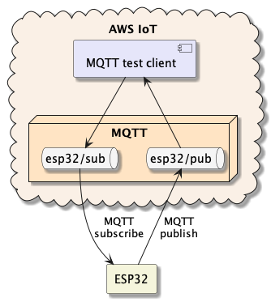

# Hello AWS

For å kommunisere med ESP32-enheten må den kobles til AWS IoT Core og autentisere seg. Du må også spesifisere hvilke MQTT- topics den har tillatelse til å publisere og abonnere på.

I denne oppgaven skal vi:
1. konfigurere opp tingen vår i AWS IoT 
2. legge inn et program på ESP32 som lar oss kommunisere med AWS IoT 
3. konfiguerere WiFi- innstillinger og sertifikater 
4. sende og motta meldinger ved hjelp av testklient på AWS IoT 

## Legg inn Hello World på ESP32
Begynn med å test at programmering mot - og kommunikasjon med - ESP32 fungerer ved å legge inn og teste Hello World.

[Klikk her for instruksjoner](HelloWorld/README.md)

Gå videre til: [AWS IoT Console](./2_AWS_IoT_Console.md)
